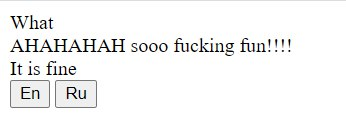
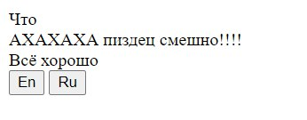

# translator
CSS variables based tool to integrate language switching to website

## Example

In your HTML file

```
<body lang="en">
    <div>
        <div class="t-what"></div>
    </div>
    <div>
        <div class="t-so-fun"></div>
    </div>
    <div>
        <div class="t-norm"></div>
    </div>

    <button id="en">En</button>
    <button id="ru">Ru</button>
</body>
```

In your JS file

```
const translator = new Translator([
    {
        lang: 'en',
        locales: {
            'what': 'What',
            'so-fun': 'AHAHAHAH sooo fucking fun!!!!',
            'norm': 'It is fine'
        }
    },
    {
        lang: 'ru',
        locales: {
            'what': 'Что',
            'so-fun': 'АХАХАХА пиздец смешно!!!!',
            'norm': 'Всё хорошо'
        }
    }
]);

document.getElementById('en').addEventListener('click', () => translator.setLanguage('en'));
document.getElementById('ru').addEventListener('click', () => translator.setLanguage('ru'));
```

Result


